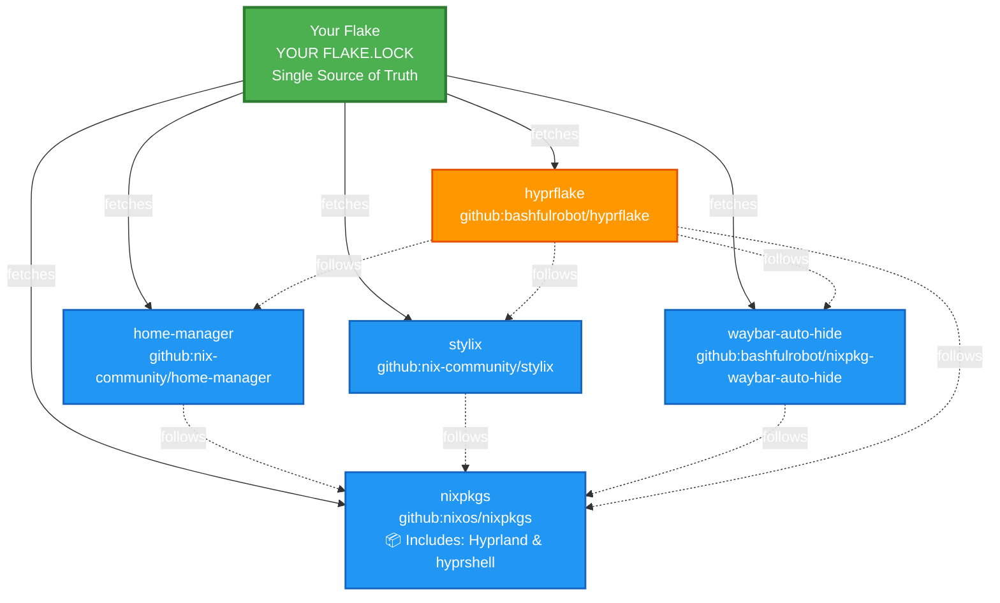

# Flake Input Management Guide

This document explains how to properly manage flake inputs when consuming hyprflake, ensuring version consistency and avoiding dependency conflicts.

## Dependency Flow Diagram

This diagram shows how a consumer flake controls all shared dependencies through the `follows` mechanism. Hyprland and hyprshell come from **nixpkgs** (not separate flake inputs).



## Legend

- **🟢 Green**: Your flake - the single source of truth
- **🔵 Blue**: Direct inputs you control (fetched from GitHub)
- **🟠 Orange (hyprflake)**: Consumed flake with ALL inputs overridden via `follows`
- **Solid arrows** (→): Fetches from GitHub
- **Dotted arrows** (⇢): `follows` relationship (uses version from your flake.lock)

## Required Configuration

To consume hyprflake properly, you **must** declare all of its inputs and use `follows`:

```nix
{
  inputs = {
    nixpkgs.url = "github:nixos/nixpkgs/nixos-unstable";

    home-manager = {
      url = "github:nix-community/home-manager";
      inputs.nixpkgs.follows = "nixpkgs";
    };

    stylix = {
      url = "github:nix-community/stylix";
      inputs.nixpkgs.follows = "nixpkgs";
    };

    waybar-auto-hide = {
      url = "github:bashfulrobot/nixpkg-waybar-auto-hide";
      inputs.nixpkgs.follows = "nixpkgs";
    };

    hyprflake = {
      url = "github:bashfulrobot/hyprflake";
      # IMPORTANT: Follow all inputs to ensure version consistency
      inputs = {
        nixpkgs.follows = "nixpkgs";
        home-manager.follows = "home-manager";
        stylix.follows = "stylix";
        waybar-auto-hide.follows = "waybar-auto-hide";
      };
    };
  };
}
```

## Key Concepts

### ✅ What You Control (via `follows`)

When you use `hyprflake.inputs.X.follows = "X"`, you're telling Nix:
- "Ignore hyprflake's flake.lock for input X"
- "Use MY version of X from my flake.lock instead"

This gives you control over:
1. **nixpkgs** - All packages come from ONE version (includes Hyprland & hyprshell)
2. **home-manager** - Matches your nixpkgs
3. **stylix** - Matches your nixpkgs
4. **waybar-auto-hide** - Matches your nixpkgs

**Benefits:**
- ✅ No duplicate dependencies
- ✅ Single source of truth in your flake.lock
- ✅ Independent update control
- ✅ Smaller closure size
- ✅ Guaranteed compatibility
- ✅ Hyprland & hyprshell from nixpkgs (stable, tested releases)
- ✅ No binary cache configuration needed (nixpkgs is cached by default)

### 📦 Hyprland & hyprshell from nixpkgs

hyprflake uses **Hyprland** and **hyprshell** from **nixpkgs** instead of upstream flakes:

**Why nixpkgs?**
- ✅ Stable, tested releases managed by nixpkgs maintainers
- ✅ No need for binary cache configuration (cachix, etc.)
- ✅ Simpler dependency tree (no Hyprland internal dependencies)
- ✅ Version compatibility guaranteed within nixpkgs
- ✅ Update with `nix flake update nixpkgs` like any other package

**What this means:**
- You control Hyprland version via your nixpkgs version
- No need to track hyprland/hyprshell flake inputs separately
- Currently nixpkgs provides Hyprland 0.52.2 (as of nixos-unstable)
- hyprshell plugin is built against the same Hyprland version from nixpkgs

## Update Examples

```bash
# Update nixpkgs (includes Hyprland, hyprshell, and all other packages)
nix flake update nixpkgs

# Update just home-manager
nix flake update home-manager

# Update just stylix
nix flake update stylix

# Update hyprflake (but it uses YOUR versions of shared deps)
nix flake update hyprflake

# Update everything
nix flake update
```

## Flake.lock Behavior

### With Follows (Recommended)

After `nix flake update`, your `flake.lock` contains:
- ✅ Direct entries for all your inputs (nixpkgs, home-manager, stylix, waybar-auto-hide)
- ✅ hyprflake entry pointing to GitHub
- ✅ All `follows` relationships resolved to YOUR versions
- ✅ Single nixpkgs version (includes Hyprland & hyprshell)

**Result:** Your flake.lock controls all dependencies, single nixpkgs version, independent updates.

### Without Follows (Not Recommended)

If you skip the `follows` configuration:
- ❌ You get hyprflake's flake.lock versions
- ❌ Multiple nixpkgs versions (wasted disk space)
- ❌ Can't update dependencies independently from hyprflake
- ❌ Potential version conflicts
- ❌ Larger closure size

## Minimal Example (Not Recommended)

If you only want hyprflake without managing other inputs:

```nix
{
  inputs = {
    nixpkgs.url = "github:nixos/nixpkgs/nixos-unstable";

    hyprflake = {
      url = "github:bashfulrobot/hyprflake";
      # Still recommended to at least follow nixpkgs
      inputs.nixpkgs.follows = "nixpkgs";
    };
  };
}
```

**Note:** This will use hyprflake's versions of home-manager, stylix, and waybar-auto-hide from its flake.lock. You won't be able to update them independently.

## Verification

After setting up your inputs, verify they're working correctly:

```bash
# Check your flake configuration
nix flake check

# See the dependency tree
nix flake metadata --json | jq .locks

# Verify hyprflake is using your nixpkgs
nix flake metadata --json | jq '.locks.nodes.hyprflake.inputs.nixpkgs'
# Should output: "nixpkgs" (not a GitHub URL)
```

## Troubleshooting

### Error: infinite recursion

**Cause:** Circular `follows` references.

**Solution:** Ensure you're only following direct dependencies, not creating cycles.

### Different package versions than expected

**Cause:** Missing `follows` directive.

**Solution:** Check that ALL of hyprflake's inputs are properly followed in your configuration.

### Large closure size

**Cause:** Duplicate dependencies from missing `follows`.

**Solution:** Add `follows` for all shared inputs (nixpkgs, home-manager, etc.).

## Additional Resources

- [Nix Flakes Manual](https://nix.dev/manual/nix/2.28/command-ref/new-cli/nix3-flake.html#flake-inputs)
- [NixOS Flakes Guide](https://nixos-and-flakes.thiscute.world/other-usage-of-flakes/inputs)
- [Nix Community Discussion on Follows](https://discourse.nixos.org/t/recommendations-for-use-of-flakes-input-follows/17413)
