# Flake Input Management Guide

This document explains how to properly manage flake inputs when consuming hyprflake, ensuring version consistency and avoiding dependency conflicts.

## Dependency Flow Diagram

This diagram shows how a consumer flake controls all shared dependencies through the `follows` mechanism, while allowing upstream flakes like Hyprland to manage their own internal dependencies.

```mermaid
graph TD
    %% Root flake
    consumer[Your Flake<br/>YOUR FLAKE.LOCK<br/>Single Source of Truth]

    %% Direct inputs from GitHub
    nixpkgs[nixpkgs<br/>github:nixos/nixpkgs]
    home-manager[home-manager<br/>github:nix-community/home-manager]
    stylix[stylix<br/>github:nix-community/stylix]
    hyprland[hyprland<br/>github:hyprwm/Hyprland]
    hyprshell[hyprshell<br/>github:H3rmt/hyprshell]
    waybar-auto-hide[waybar-auto-hide<br/>github:bashfulrobot/nixpkg-waybar-auto-hide]
    hyprflake[hyprflake<br/>github:bashfulrobot/hyprflake]

    %% Consumer's direct inputs
    consumer -->|fetches| nixpkgs
    consumer -->|fetches| home-manager
    consumer -->|fetches| stylix
    consumer -->|fetches| hyprland
    consumer -->|fetches| hyprshell
    consumer -->|fetches| waybar-auto-hide
    consumer -->|fetches| hyprflake

    %% Follows relationships from direct inputs
    home-manager -.->|follows| nixpkgs
    stylix -.->|follows| nixpkgs
    hyprland -.->|follows| nixpkgs
    hyprshell -.->|follows hyprland| hyprland
    waybar-auto-hide -.->|follows| nixpkgs

    %% hyprflake's inputs (ALL overridden via follows)
    hyprflake -.->|follows| nixpkgs
    hyprflake -.->|follows| home-manager
    hyprflake -.->|follows| stylix
    hyprflake -.->|follows| hyprland
    hyprflake -.->|follows| hyprshell
    hyprflake -.->|follows| waybar-auto-hide

    %% Hyprland's internal dependencies (NOT controlled by consumer)
    aquamarine[aquamarine<br/>🔒 Hyprland manages]
    hyprcursor[hyprcursor<br/>🔒 Hyprland manages]
    hyprutils[hyprutils<br/>🔒 Hyprland manages]
    hyprlang[hyprlang<br/>🔒 Hyprland manages]
    hyprwayland-scanner[hyprwayland-scanner<br/>🔒 Hyprland manages]

    hyprland -->|manages internally| aquamarine
    hyprland -->|manages internally| hyprcursor
    hyprland -->|manages internally| hyprutils
    hyprland -->|manages internally| hyprlang
    hyprland -->|manages internally| hyprwayland-scanner

    %% Styling
    classDef root fill:#4CAF50,stroke:#2E7D32,stroke-width:3px,color:#fff
    classDef controlled fill:#2196F3,stroke:#1565C0,stroke-width:2px,color:#fff
    classDef followed fill:#FF9800,stroke:#E65100,stroke-width:2px,color:#fff
    classDef internal fill:#9E9E9E,stroke:#424242,stroke-width:2px,color:#fff

    class consumer root
    class nixpkgs,home-manager,stylix,hyprland,hyprshell,waybar-auto-hide controlled
    class hyprflake followed
    class aquamarine,hyprcursor,hyprutils,hyprlang,hyprwayland-scanner internal
```



## Legend

- **🟢 Green**: Your flake - the single source of truth
- **🔵 Blue**: Direct inputs you control (fetched from GitHub)
- **🟠 Orange (hyprflake)**: Consumed flake with ALL inputs overridden via `follows`
- **⚫ Gray**: Internal dependencies managed by upstream (Hyprland)
- **Solid arrows** (→): Fetches from GitHub
- **Dotted arrows** (⇢): `follows` relationship (uses version from your flake.lock)

## Required Configuration

To consume hyprflake properly, you **must** declare all of its inputs and use `follows`:

```nix
{
  inputs = {
    nixpkgs.url = "github:nixos/nixpkgs/nixos-unstable";

    home-manager = {
      url = "github:nix-community/home-manager";
      inputs.nixpkgs.follows = "nixpkgs";
    };

    stylix = {
      url = "github:nix-community/stylix";
      inputs.nixpkgs.follows = "nixpkgs";
    };

    hyprland = {
      url = "github:hyprwm/Hyprland";
      inputs.nixpkgs.follows = "nixpkgs";
    };

    hyprshell = {
      url = "github:H3rmt/hyprshell?ref=hyprshell-release";
      inputs.hyprland.follows = "hyprland";
    };

    waybar-auto-hide = {
      url = "github:bashfulrobot/nixpkg-waybar-auto-hide";
      inputs.nixpkgs.follows = "nixpkgs";
    };

    hyprflake = {
      url = "github:bashfulrobot/hyprflake";
      # IMPORTANT: Follow all inputs to ensure version consistency
      inputs = {
        nixpkgs.follows = "nixpkgs";
        home-manager.follows = "home-manager";
        stylix.follows = "stylix";
        hyprland.follows = "hyprland";
        hyprshell.follows = "hyprshell";
        waybar-auto-hide.follows = "waybar-auto-hide";
      };
    };
  };
}
```

## Key Concepts

### ✅ What You Control (via `follows`)

When you use `hyprflake.inputs.X.follows = "X"`, you're telling Nix:
- "Ignore hyprflake's flake.lock for input X"
- "Use MY version of X from my flake.lock instead"

This gives you control over:
1. **nixpkgs** - All packages come from ONE version
2. **home-manager** - Matches your nixpkgs
3. **stylix** - Matches your nixpkgs
4. **hyprland** - You control which Hyprland version
5. **hyprshell** - Uses YOUR hyprland version
6. **waybar-auto-hide** - Matches your nixpkgs

**Benefits:**
- ✅ No duplicate dependencies
- ✅ Single source of truth in your flake.lock
- ✅ Independent update control
- ✅ Smaller closure size
- ✅ Guaranteed compatibility

### 🔒 What You DON'T Control (and shouldn't)

Hyprland's internal dependencies are tested together by upstream:
- aquamarine
- hyprcursor
- hyprutils
- hyprlang
- hyprwayland-scanner
- hyprgraphics
- hyprwire
- And many more...

**Why not override these?**
- Hyprland developers test specific versions together
- Breaking changes between these can cause crashes
- You gain minimal benefit from controlling them
- Let upstream manage their own dependency tree

**Best Practice:** Only use `follows` for dependencies you share with hyprflake, not for Hyprland's internal dependencies.

## Update Examples

```bash
# Update just Hyprland (and its internal deps)
nix flake update hyprland

# Update just nixpkgs (affects everything that follows it)
nix flake update nixpkgs

# Update hyprflake (but it uses YOUR versions of shared deps)
nix flake update hyprflake

# Update everything
nix flake update
```

## Flake.lock Behavior

### With Follows (Recommended)

After `nix flake update`, your `flake.lock` contains:
- ✅ Direct entries for all your inputs (nixpkgs, hyprland, etc.)
- ✅ Hyprland's deep dependency tree (managed by Hyprland)
- ✅ hyprflake entry pointing to GitHub
- ✅ All `follows` relationships resolved to YOUR versions

**Result:** Your flake.lock controls shared dependencies, single nixpkgs version, independent updates.

### Without Follows (Not Recommended)

If you skip the `follows` configuration:
- ❌ You get hyprflake's flake.lock versions
- ❌ Multiple nixpkgs versions (wasted disk space)
- ❌ Can't update Hyprland independently from hyprflake
- ❌ Potential version conflicts
- ❌ Larger closure size

## Minimal Example (Not Recommended)

If you only want hyprflake without any other Hyprland configuration:

```nix
{
  inputs = {
    nixpkgs.url = "github:nixos/nixpkgs/nixos-unstable";

    hyprflake = {
      url = "github:bashfulrobot/hyprflake";
      # Still recommended to at least follow nixpkgs
      inputs.nixpkgs.follows = "nixpkgs";
    };
  };
}
```

**Note:** This will use hyprflake's versions of home-manager, stylix, and hyprland from its flake.lock. You won't be able to update them independently.

## Verification

After setting up your inputs, verify they're working correctly:

```bash
# Check your flake configuration
nix flake check

# See the dependency tree
nix flake metadata --json | jq .locks

# Verify hyprflake is using your nixpkgs
nix flake metadata --json | jq '.locks.nodes.hyprflake.inputs.nixpkgs'
# Should output: "nixpkgs" (not a GitHub URL)
```

## Troubleshooting

### Error: infinite recursion

**Cause:** Circular `follows` references.

**Solution:** Ensure you're only following direct dependencies, not creating cycles.

### Different package versions than expected

**Cause:** Missing `follows` directive.

**Solution:** Check that ALL of hyprflake's inputs are properly followed in your configuration.

### Large closure size

**Cause:** Duplicate dependencies from missing `follows`.

**Solution:** Add `follows` for all shared inputs (nixpkgs, home-manager, etc.).

## Additional Resources

- [Nix Flakes Manual](https://nix.dev/manual/nix/2.28/command-ref/new-cli/nix3-flake.html#flake-inputs)
- [NixOS Flakes Guide](https://nixos-and-flakes.thiscute.world/other-usage-of-flakes/inputs)
- [Nix Community Discussion on Follows](https://discourse.nixos.org/t/recommendations-for-use-of-flakes-input-follows/17413)
